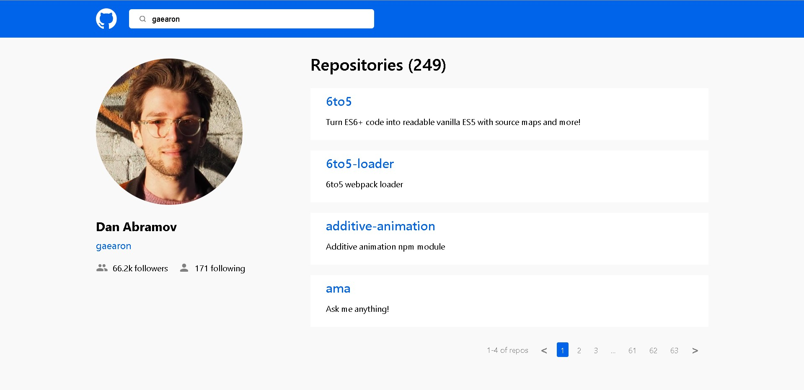

# GitHub User

«GitHub User» - is a test ReactJS project.

[Deploy](https://test-github-user.netlify.app)

## Stack

- React
- Redux Toolkit
- React Redux
- Axios
- React Paginate

## Install

```bash
$ git clone https://github.com/katada93/test-github-app.git
$ npm install / yarn install
```

## Run

```bash
$ npm start / yarn start
```

## Screenshot


